# watchStock かんたん導入ガイド

スマホを出せないときでも、Apple Watch で株価の動きが分かるようにする手順です。専門知識は要りません。上から順番に進めてください。全部で 30 分ほどかかります。

> 図のうち「イラスト」と書いてあるものは説明用の絵です。実際の画面とは細部が異なります。アプリ（watchStock）の画面は実際の画面です。
>
> GitHub と Cloudflare の画面は、英語で表示されることがあります。このガイドでは、ボタンの名前に英語表示のときの例も添えています。

---

## 1. できること

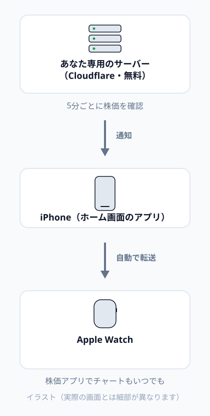

- **株価の通知が Watch に届く**
  - 取引時間中に、決まった間隔で「株価のまとめ」が届きます（最初は 30 分ごと）
  - 株価が大きく動いたとき（最初は前日比 ±2% ごと）に「上昇アラート」「下落アラート」が届きます
- **いつでも Watch で株価とチャートを見られる**
  - Apple Watch に最初から入っている「株価」アプリを使います
- **費用は 0 円**
  - あなた専用のサーバーを、無料の範囲で動かします。クレジットカードの登録も不要です

株価はおよそ 15 分遅れです。売買の判断はご自身の責任でお願いします。

---

## 2. 用意するもの

| もの | 条件 |
| --- | --- |
| スマホ | **iPhone**（iOS 16.4 以降。「設定」→「一般」→「情報」で確認できます）、または **Android**（Chrome が入っているもの） |
| 腕時計 | iPhone なら **Apple Watch**。Android なら、スマホの通知が届く腕時計（Wear OS、Galaxy Watch、Huawei、Garmin など） |
| メールアドレス | 2 つのサービスに登録するのに使います。同じアドレスで構いません |
| 合言葉 | 自分で決めます。**12 文字以上**で、他人に推測されにくいもの（例: `hanako-2026-kabu`。この例はそのまま使わず、自分で考えてください）。紙などにメモしておいてください |

パソコンがあると、手順 3 は大きな画面でできるので楽です。iPhone だけでもできます。

---

## 3. あなた専用のサーバーを作る（最初の 1 回だけ）

ここでは 2 つの無料サービスに登録します。

- **GitHub**: アプリの設計図（プログラム）をしまっておく場所
- **Cloudflare**: アプリを動かす場所

どちらも登録は無料で、このアプリの範囲では料金はかかりません。

### 3-1. GitHub に登録する

1. https://github.com/signup を開きます
2. メールアドレス、パスワード、ユーザー名（英数字）を入力して、アカウントを作成します
3. メールで届く確認コードを入力します

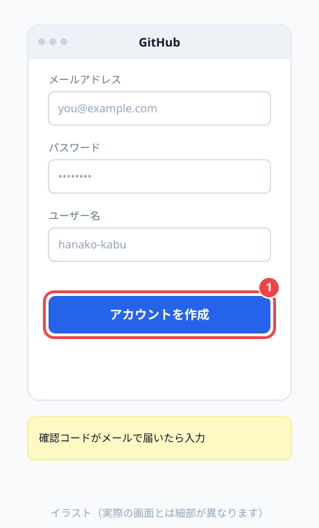

### 3-2. Cloudflare に登録する

1. https://dash.cloudflare.com/sign-up を開きます
2. メールアドレスとパスワードを入力して、アカウントを作成します
3. 届いたメールのリンクを押して、メールアドレスを確認します

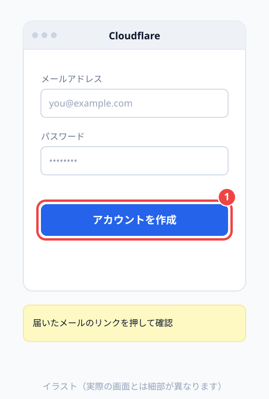

### 3-3. ボタンを押して作る

1. 下のボタンを押します

   

2. Cloudflare の画面が開きます。「GitHub と連携する」（英語表示なら Connect GitHub など）を押し、3-1 で作った GitHub のアカウントでログインして許可します

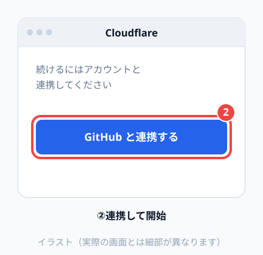

3. GitHub の**リポジトリ**（アプリの設計図をしまう場所）を選ぶ欄が出ます。置き場所は自分の GitHub アカウントを選び、名前は `watchstock` のままで構いません
4. 設定の画面で、**ACCESS_TOKEN（合言葉）** の欄に、あなたが決めた合言葉を入力します。ほかの欄はそのままで構いません。この欄が見当たらなければ、そのまま進んで、あとで 3-4 の手順で設定します
5. 「作成してデプロイ」（英語表示なら Create and deploy）を押します

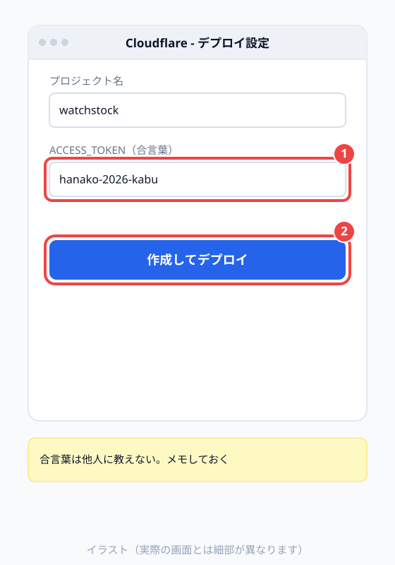

6. 数分待つと完了します。`https://watchstock.〇〇〇.workers.dev` という形の URL が表示されるので、**この URL をメモ**してください。これがあなた専用のアプリの住所です

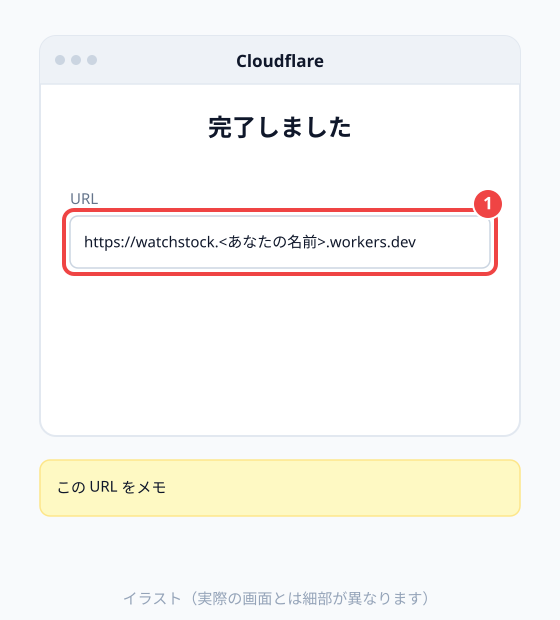

> 「workers.dev のサブドメイン」を決めるよう求められたら、好きな英数字（例: `hanako-kabu`）を入力してください。URL の「〇〇〇」の部分になります。決めた直後の数分間は、URL を開いてもエラーになることがあります。少し待ってから開き直してください。

### 3-4. 合言葉の欄が出なかったとき

設置の途中で合言葉を入れる欄が出なかった場合は、ここで設定します。アプリを開いたときに「合言葉がまだ設定されていません」と表示された場合も同じです。

1. https://dash.cloudflare.com にログインし、「Workers & Pages」（または「コンピューティング」）を開きます
2. 一覧から `watchstock` を選びます
3. 「設定」（Settings）→「変数とシークレット」（Variables and Secrets）→「追加」（Add）を押します
4. 種類は「シークレット」（Secret）、名前は `ACCESS_TOKEN`、値はあなたが決めた合言葉を入力して保存（デプロイ）します

---

## 4. iPhone にアプリを入れる

Android の人は、4 と 5 の代わりに「[5A. Android の場合](#5a-android-の場合)」に進んでください。

### 4-1. Safari で開いて、ホーム画面に追加する

1. iPhone の **Safari** で、3-3 でメモした URL を開きます（Chrome など、ほかのブラウザではなく Safari を使ってください）
2. 画面下の共有ボタン（四角から矢印が出ているマーク）を押します

   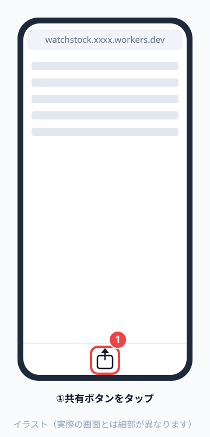

3. 「ホーム画面に追加」を押します

   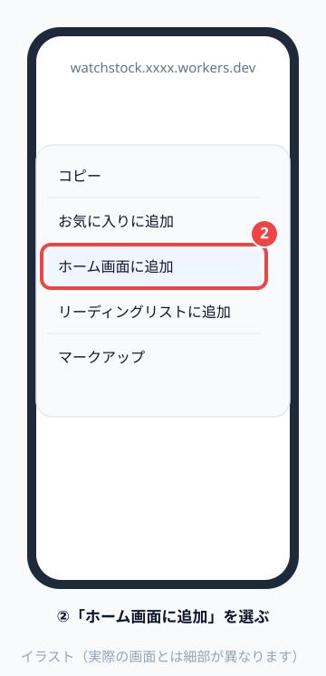

4. 右上の「追加」を押します

   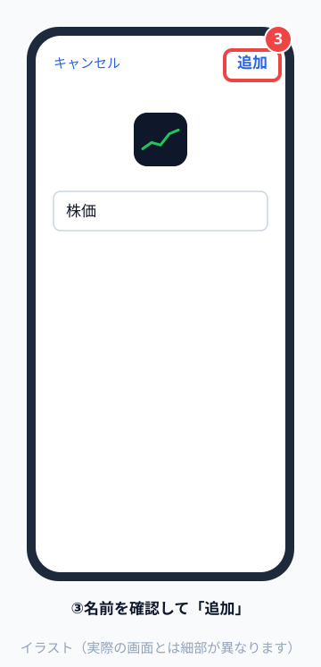

Safari で開いた時点では、下のような案内が出ます。ホーム画面に追加すれば消えます。

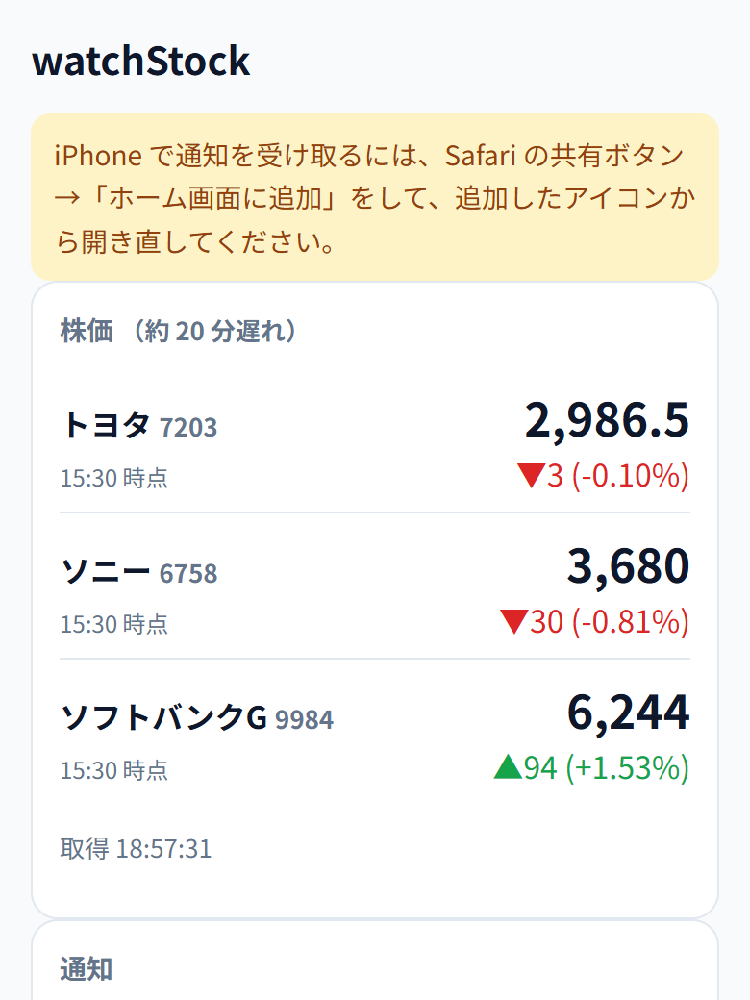

### 4-2. ホーム画面のアイコンから開く

ホーム画面に「株価」というアイコンができます。**必ずこのアイコンから開いてください**。Safari から開くと、通知を受け取れません。

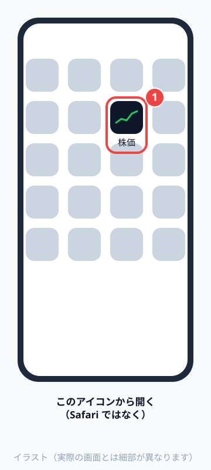

### 4-3. 合言葉を入れる

最初に合言葉を聞かれます。3-3 で決めた合言葉を入力して「はじめる」を押します。一度入れれば、次からは聞かれません。

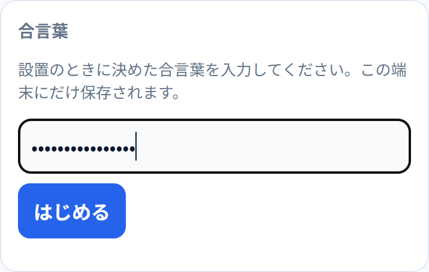

株価が表示されれば成功です。

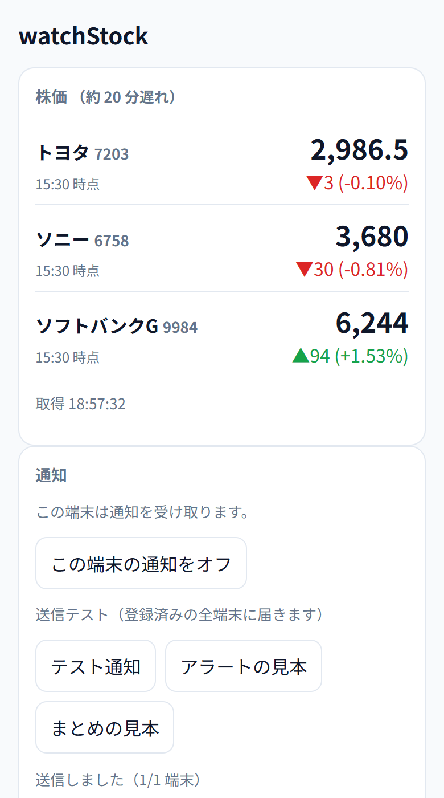

---

## 5. 通知をオンにする

### 5-1. 通知を許可する

1. 「通知」の欄の「通知をオン」を押します

   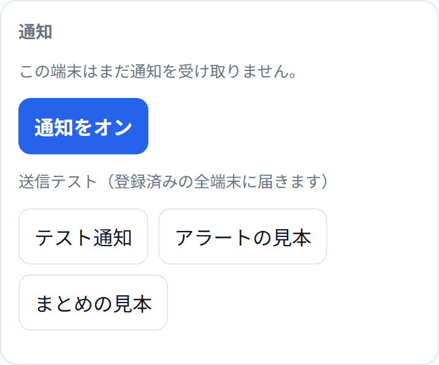

2. 「通知を許可しますか？」と聞かれたら「許可」を押します

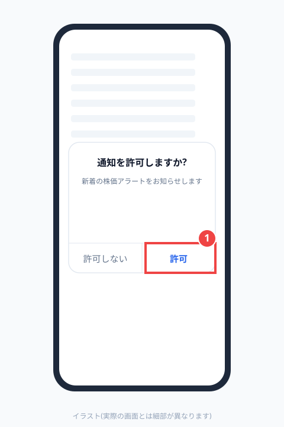

### 5-2. 試しに通知を送る

「テスト通知」を押します。数秒で iPhone に通知が届きます。

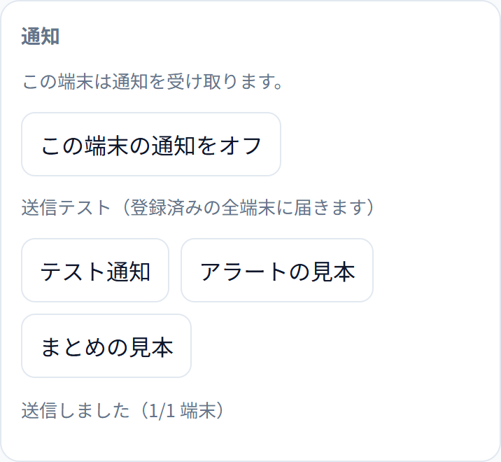

「アラートの見本」「まとめの見本」を押すと、本番と同じ文面の通知を試せます。

### 5-3. Watch に届くか確かめる

「テスト通知」を押したら、**すぐに iPhone の画面を消して**（横のボタンを 1 回押してロック）待ちます。数秒で Watch に通知が届けば完了です。

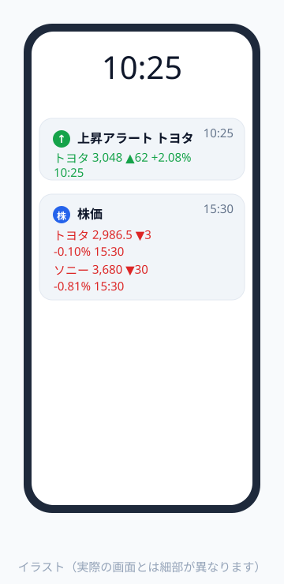

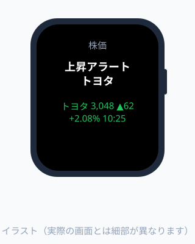

iPhone を手に持って画面がついているときは、通知は iPhone にだけ表示され、Watch には届きません。これは Apple Watch の仕様です。

---

## 5A. Android の場合

Android では、Chrome でアプリを入れて通知を受け取ります。

1. Android の **Chrome** で、3-3 でメモした URL を開きます
2. 上に出る案内の「ホーム画面に追加」を押します（ボタンが出ないときは、Chrome のメニュー（︙）→「ホーム画面に追加」または「アプリをインストール」）

   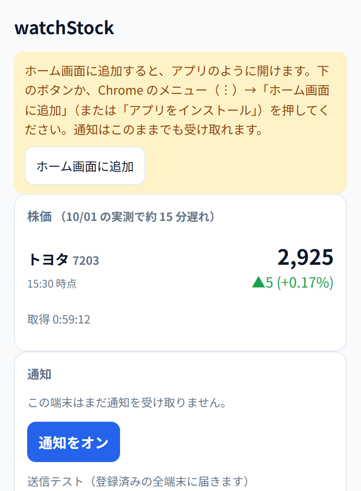

3. ホーム画面の「株価」アイコンから開き、合言葉を入れて「はじめる」を押します（4-3 と同じです）
4. 「通知をオン」を押し、通知を許可します
5. 「テスト通知」を押して、スマホに通知が届くことを確かめます

**腕時計に通知を届ける**

腕時計のアプリ（Galaxy Wearable、Pixel Watch、Huawei Health、Garmin Connect など）の通知の設定で、**Chrome** の通知をオンにします。スマホの通知が腕時計に転送されるようになります。設定の場所は腕時計のメーカーによって違うので、腕時計のアプリで「通知」を探してください。

**Android でできないこと**

- 「7. Watch でいつでも株価とチャートを見る」は Apple Watch 専用です。Android の腕時計では、届いた通知を見る形になります。最後に届いた「株価のまとめ」は腕時計の通知一覧に残るので、そこで直近の株価を確認できます
- スマホでは、ホーム画面の「株価」アイコンを開けばいつでも最新の株価を見られます

---

## 6. 銘柄と通知の設定を変える

アプリを下に進むと「通知の設定」があります。変えたら「保存」を押してください。次の通知から反映されます。

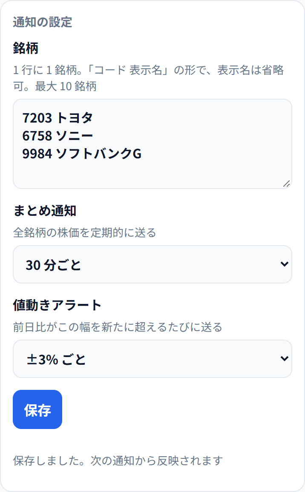

| 項目 | 書き方・選び方 |
| --- | --- |
| 銘柄 | 1 行に 1 銘柄。「証券コード（4 桁）」と「表示したい名前」をスペースで区切ります。例: `7203 トヨタ`。最大 10 銘柄 |
| まとめ通知 | 全銘柄の株価をまとめて送る間隔。「送らない」も選べます |
| 値動きアラート | 前日比がこの幅を超えるたびに送ります。例えば「±2% ごと」なら、+2%、+4%… と、-2%、-4%… のときに届きます。同じ日に同じ段階では 1 回だけです |

証券コードが間違っていると、保存するときに「株価を取得できません」と表示されます。証券コードは、会社名と「株価」で検索すると見つかります。

通知が届くのは平日の 9:00〜16:00 です。土日祝日は届きません。

---

## 7. Watch でいつでも株価とチャートを見る

### 7-1. Apple の「株価」アプリを使う（おすすめ）

Apple Watch に最初から入っている「株価」アプリで、株価とチャートをいつでも見られます。

1. iPhone の「株価」アプリを開きます（見当たらなければ App Store で「株価」を検索して入れ直せます）
2. 検索欄に証券コード（例: `7203`）を入力し、出てきた銘柄の「＋」を押してウォッチリストに追加します

   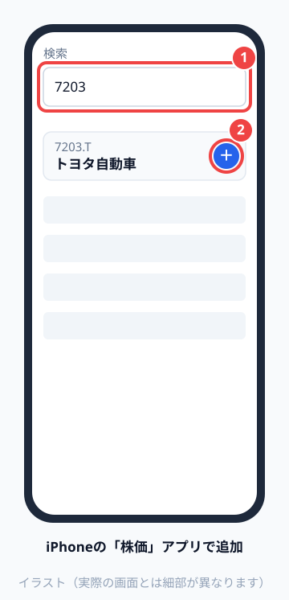

3. Apple Watch の「株価」アプリを開くと、同じ銘柄が表示されます。銘柄を押すとチャートが見られます

   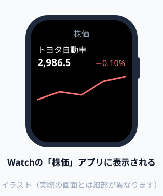

「株価」アプリの数字は Apple が提供しているもので、watchStock の通知の数字とは更新のタイミングが少しずれることがあります。

### 7-2. 文字盤のボタンで watchStock の株価を見る（お好みで）

watchStock に登録した銘柄の株価を、文字盤のボタン 1 つで表示できます。

1. watchStock アプリの下のほうにある「URL をコピー」を押します

   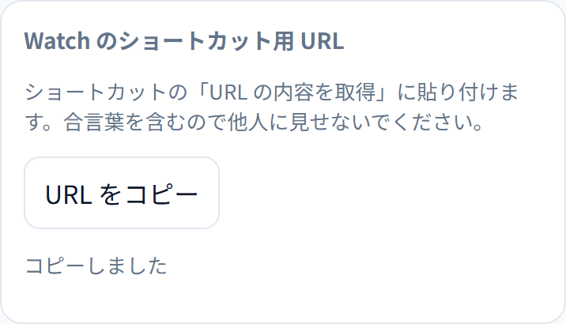

2. iPhone の「ショートカット」アプリを開き、右上の「＋」で新しいショートカットを作ります
3. 「アクションを追加」で **URL の内容を取得** を探して追加し、URL の欄にコピーした URL を貼り付けます

   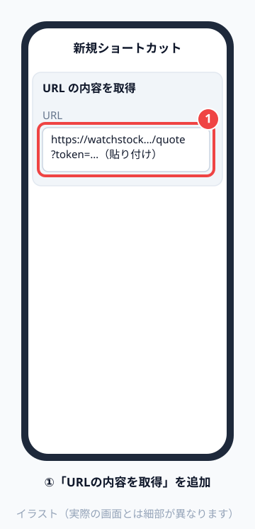

4. 続けて **結果を表示** を追加します

   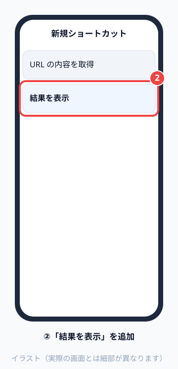

5. ショートカットの詳細（ⓘ）で **Apple Watch に表示** をオンにします

   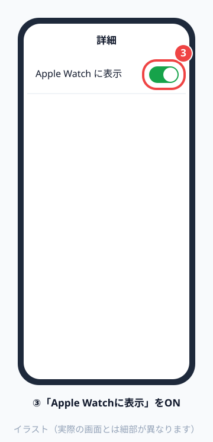

6. Watch の文字盤を長押し →「編集」→ コンプリケーションの欄を選び、「ショートカット」から作ったショートカットを選びます
7. 文字盤に置いたボタンを押すと、その時点の株価（約 15 分遅れ）が表示されます

   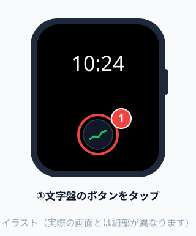 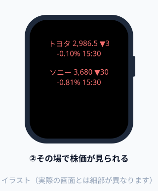

コピーした URL には合言葉が入っています。このショートカットは他人に共有しないでください。

---

## 8. 困ったとき

**通知が届かない**
- ホーム画面の「株価」アイコンから開いて「通知をオン」を押しましたか（Safari から開いた画面ではオンにできません）
- iPhone の「設定」→「通知」→「株価」で、通知が許可されているか確認してください
- 集中モード（おやすみモードなど）がオンになっていないか確認してください
- 土日祝日や、平日の 16:00 以降は届きません
- アプリの「送信履歴」に記録があれば、サーバーからは送れています。iPhone 側の設定を確認してください

**iPhone には届くが Watch に届かない**
- iPhone の「Watch」アプリ →「通知」→「株価」が「iPhone を反映」になっているか確認してください
- Android の場合は、腕時計のアプリの通知設定で Chrome がオンになっているか確認してください
- iPhone の画面がついていると、通知は Watch に届きません

**合言葉を忘れた**
- Cloudflare にログインし、「Workers」の一覧から `watchstock` を選び、「設定」の「変数とシークレット」（英語表示なら Settings → Variables and Secrets）で ACCESS_TOKEN を新しい合言葉に変えてください。そのあと、アプリの「合言葉を消す」を押して新しい合言葉を入れ直します

**株価の数字が古い**
- 約 15 分遅れの株価です。数字の横の時刻が、その株価の時刻です

**お金はかかりますか**
- かかりません。GitHub と Cloudflare の無料の範囲で動きます。クレジットカードの登録も不要です

**iPhone を買い替えた**
- 新しい iPhone で「4. iPhone にアプリを入れる」からやり直してください。サーバーはそのまま使えます

**やめたい**
- ホーム画面の「株価」アイコンを削除します。Cloudflare の「Workers」から `watchstock` を削除すると、サーバーも止まります

---

## 付録: 設置を人に手伝ってもらう場合

手順 3 が難しい場合は、詳しい人に設置を頼めます。この場合も、サーバーは**あなたの Cloudflare アカウント**に作ります（ほかの人のアカウントに作ってもらうと、その人があなたに株価を配ることになり、データ提供元の利用条件に触れるおそれがあるためです）。

1. あなたが 3-2 の手順で Cloudflare に登録します
2. Cloudflare にログインし、アカウントの管理画面の「メンバー」（英語表示なら Members）で「メンバーを招待」（Invite）を押し、手伝ってくれる人のメールアドレスを入力して招待を送ります

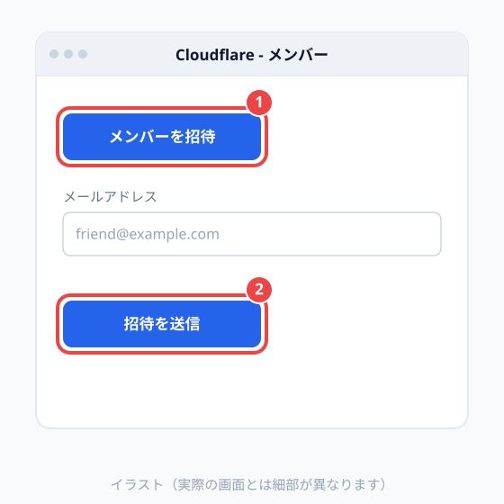

3. 手伝ってくれる人に、合言葉を決めて設置してもらいます（手順は README.md の「セットアップ」）
4. 完成した URL と合言葉を受け取ったら、「4. iPhone にアプリを入れる」から進めます
5. 設置が終わったら、メンバーから外して構いません
